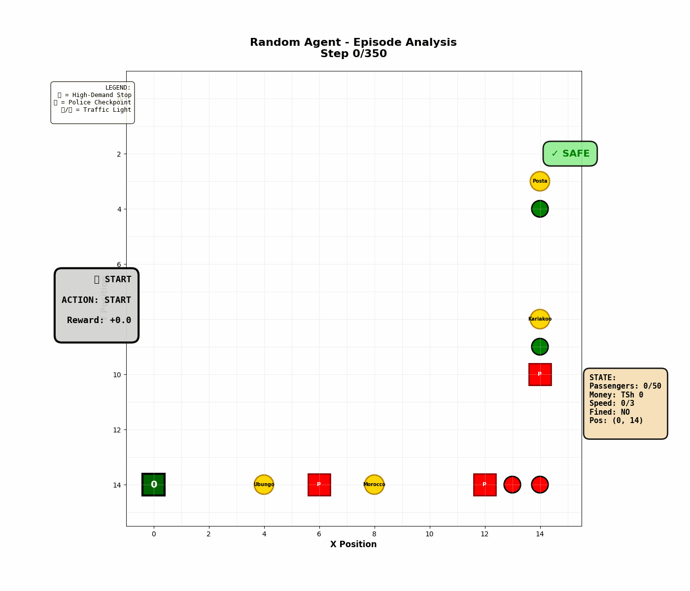
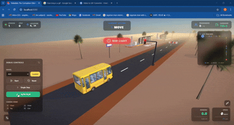

# Daladala Autonomous Transit Agent: Learning to Survive Dar es Salaam's Overloading Trap

## Project Overview

This project applies reinforcement learning to address Tanzania's critical road safety crisis: **42% of road deaths are daladala passengers** (WHO 2023). The average daladala carries **58 passengers in a 33-seater bus**, causing catastrophic accidents due to overloading.

**The Mission**: Train RL agents to discover the optimal balance between profitability and safety so that drivers should operate at optimal capacity and always comply with traffic laws to maximize long-term rewards.

---
## Video Demo
[](https://youtu.be/4W0shnN6tlI)

---

## Problem Statement

### The Real-World Context
- **Country**: Tanzania, Dar es Salaam
- **Problem**: Overloaded public transport (daladalas) causes 40% of fatal road accidents
- **Root Cause**: Drivers earn only ~TSh 22,000/day operating legally → forced to overload
- **Challenge**: How can RL teach agents to maximize profit while minimizing crashes and fines?

### Why RL?
Traditional rule-based systems fail because they don't account for:
- Trade-offs between risk (overloading) and reward (more passengers = more income)
- Dynamic decision-making under uncertainty (will I get caught at this police checkpoint?)
- Exploration vs. exploitation

RL discovers this balance autonomously through trial and error.

---

## Environment Design

### Grid Layout
- **15×15 grid** representing the fixed route: **Ubungo → Morocco → Kariakoo → Posta**
- Route traversal: 15 cells right (x=0→14 at y=14), then 15 cells up (y=14→0 at x=14)

### Agent (Daladala Bus)
- **Legal Capacity**: 33 passengers
- **Physical Maximum**: 50 passengers
- **Starting State**: At Ubungo (0, 14), 0 passengers, 0 money

### Stops & Hazards
| Type | Locations | Purpose |
|------|-----------|---------|
| **High-Demand Stops** | (4,14), (8,14), (14,8), (14,3) | Pick up/drop off passengers |
| **Police Checkpoints** | Randomized (3 per episode) | Enforce legal capacity |
| **Traffic Lights** | Randomized (4 per episode) | Cyclic red/green |

---

## Action Space (5 Discrete Actions)

| Action | Code | Effect |
|--------|------|--------|
| **Move Forward** | 0 | Advance 1 cell (progress = +2 reward) |
| **Pick Up Passengers** | 1 | At high-demand stop: +passengers |
| **Drop Off Passengers** | 2 | At high-demand stop: -passengers, +revenue |
| **Stop** | 3 | Decelerate/Hold position (safe at police/lights) |
| **Speed Up** | 4 | Accelerate (RISKY if overloaded/near hazards) |

---

## Observation Space (14 Features, Normalized to [-1, 1])

| Index | Feature | Range | Purpose |
|-------|---------|-------|---------|
| 0 | pos_x | [0, 14] | X coordinate |
| 1 | pos_y | [0, 14] | Y coordinate |
| 2 | current_passengers | [0, 50] | Occupancy level |
| 3 | money_earned | [0, 150000] | TSh earned |
| 4 | current_speed | [0, 3] | Movement speed |
| 5 | light_is_red | {0, 1} | Red light now? |
| 6 | police_checkpoint_here | {0, 1} | Police here? |
| 7 | **must_stop_now** | {0, 1} | **CRITICAL FLAG** (police OR red light) |
| 8 | at_high_demand_stop | {0, 1} | At pickup/dropoff? |
| 9 | passengers_waiting | [0, 10] | Demand at current stop |
| 10 | must_stop_next | {0, 1} | Hazard in next cell? |
| 11 | distance_to_traffic_light | Lookahead | Traffic light proximity |
| 12 | distance_to_police | Lookahead | Police checkpoint proximity |
| 13 | episode_progress | [0, 1] | Step count / max_steps |

---

## Reward Structure

### Progress & Delivery
- **+2**: Per step forward (encourage efficiency)
- **+12**: Per passenger dropped off
- **+100**: Reaching final destination (Posta)
- **+50**: Perfect legal trip bonus (≤33 passengers at Posta)

### Safety & Compliance
- **+25**: Voluntarily stopping at police/red light (`must_stop_now=1` AND action=3)
- **-40**: Ignoring police/red light (action≠3 when `must_stop_now=1`)
- **+15**: Valid pickup at stop
- **-3**: Unnecessary stop

### Penalties
- **-20**: Light fine (34–40 passengers at police checkpoint)
- **-50**: Heavy fine + episode ends (>40 passengers at police)
- **-30**: Accident + episode ends (overloaded + speeding)
- **-5 to -8**: Invalid pickup/dropoff actions

---

## Terminal Conditions

**Success**:
- Reach Posta (final cell)

**Failure**:
- Caught with >40 passengers at police checkpoint
- Accident (overloaded + speeding)

**Truncation**:
- 350 steps elapsed without success/failure

---

## RL Algorithms Implemented

### 1. **DQN** (Value-Based)
- **Architecture**: MLP policy (14 → 64 → 64 → 5)
- **Training**: 300,000 timesteps
- **Hyperparameters Tuned**: 12 configurations
  - Learning rates: 1e-4, 3e-4, 5e-4, 7e-4, 1e-3
  - Buffer sizes: 10k, 50k, 100k
  - Exploration fractions: 0.25, 0.5, 1.0

### 2. **PPO** (Policy Gradient)
- **Architecture**: MLP policy (14 → 64 → 64 → 5)
- **Training**: 300,000 timesteps
- **Hyperparameters Tuned**: 12 configurations
  - Learning rates: 1e-4, 3e-4, 5e-4, 7e-4, 1e-3
  - Entropy coefficients: 0.0, 0.005, 0.01
  - n_steps: 512, 1024, 2048

### 3. **A2C** (Actor-Critic)
- **Architecture**: MLP policy (14 → 64 → 64 → 5)
- **Training**: 300,000 timesteps
- **Hyperparameters Tuned**: 12 configurations
  - Learning rates: 1e-4, 3e-4, 5e-4, 7e-4, 1e-3
  - Gamma values: 0.65, 0.70, 0.75, 0.80, 0.90, 0.95, 0.995
  - n_steps: 5, 8, 10
  - Entropy coefficients: 0.0, 0.005, 0.01, 0.05

### 4. **REINFORCE** (Policy Gradient)
- **Architecture**: Neural network policy (14 → hidden → hidden → 5)
- **Training**: 300,000 timesteps
- **Hyperparameters Tuned**: 12 configurations
  - Learning rates: 1e-3, 3e-3, 5e-3, 1e-2
  - Hidden sizes: 64, 128, 256

---

## Project Structure

```
project_root/
├── 3d-render/                    # React + Three.js Frontend
│   ├── src/                      
│   ├── public/                   
│   └── package.json              
├── environment/
│   ├── __init__.py
│   ├── daladala_env.py          
│   └── rendering.py              
├── training/
│   ├── dqn_training.py           
│   ├── ppo_training.py          
│   ├── a2c_training.py           
│   └── reinforce_training.py     
├── models/
│   ├── dqn/best_dqn.zip          # Best DQN model
│   ├── ppo/best_ppo.zip          # Best PPO model
│   ├── a2c/best_a2c.zip          # Best A2C model
│   └── reinforce/best_reinforce_policy.pth  # Best REINFORCE model
├── results/
│   ├── dqn_results.json
│   ├── ppo_results.json
│   ├── a2c_results.json
│   ├── reinforce_results.json
│   └── plots/                    
├── notebooks/                    
├── flask_api.py                  
├── main.py                       
├── requirements.txt              
└── README.md                    
```

---

## Installation & Usage

### Requirements
- Python 3.8+
- See `requirements.txt` for exact dependencies

### Setup
```bash
pip install -r requirements.txt
```

### Training All Models (12 configurations each)
```bash
# Train DQN (300k steps, ~30 min)
python training/dqn_training.py

# Train PPO (300k steps, ~25 min)
python training/ppo_training.py

# Train A2C (300k steps, ~20 min)
python training/a2c_training.py

# Train REINFORCE (3000 episodes, ~40 min)
python training/reinforce_training.py
```

Results saved to `results/*.json`.

### Visualize Random Agent (No Training)
```bash
python random_demo2.py
# Generates: random_demo.gif
```

### 3D Visualization (Web-Based)
This project includes a AAA-quality 3D visualization built with React, Three.js, and Flask.

**1. Start the Backend API:**
```bash
python flask_api.py
# Server starts at http://localhost:5000
```

**2. Start the Frontend (in a new terminal):**
```bash
cd 3d-render
npm install
npm run dev
# Open http://localhost:8080 in your browser
```

The 3D interface allows you to:
- Select and load different trained models (DQN, PPO, A2C, REINFORCE)
- Watch the agent navigate a 3D city environment
- View real-time stats (Speed, Passengers, Rewards)
- Toggle camera views (Chase, Driver, Top-Down, Cinematic)

---

## Key Findings

### Expected Agent Behavior
After training, agents should discover:
1. **Safe operation**: Maximize passengers up to legal limit (33) or slightly above (34-40) if safe, but strictly avoid >40 (severe penalty).
2. **Traffic compliance**: Always stop at police/red lights (mandatory to avoid -40 penalty).
3. **Efficiency**: Minimize stops where unnecessary to maximize progress rewards.

### Why This Works
- **Legal operation**: High rewards from passenger delivery (+12/pax) and completion bonuses (+100 + 50).
- **Reckless overloading** (>40 pax): -50 heavy fine OR -30 crash = CATASTROPHE.
- **Traffic violation**: -40 penalty per violation, accumulates quickly.

**Equilibrium**: Maximize passengers within safe limits, obey all traffic laws → highest long-term expected reward (~430).

---

## Visualization
### 2D Simulation (Pygame)



### 3D Simulation (Web-Based)


---

## Results Summary

See `results/plots/` for visualizations.

**Findings**:
1. **DQN**: Highest peak performance (~431 reward), excellent safety compliance.
2. **PPO**: Fastest convergence (~450 episodes) and best generalization to new scenarios.
3. **A2C**: Good initial learning but higher variance.
4. **REINFORCE**: Slowest convergence and high instability.

---
